# การสำรองข้อมูล (Backup)
## 9.5.6 Back up Files with File History

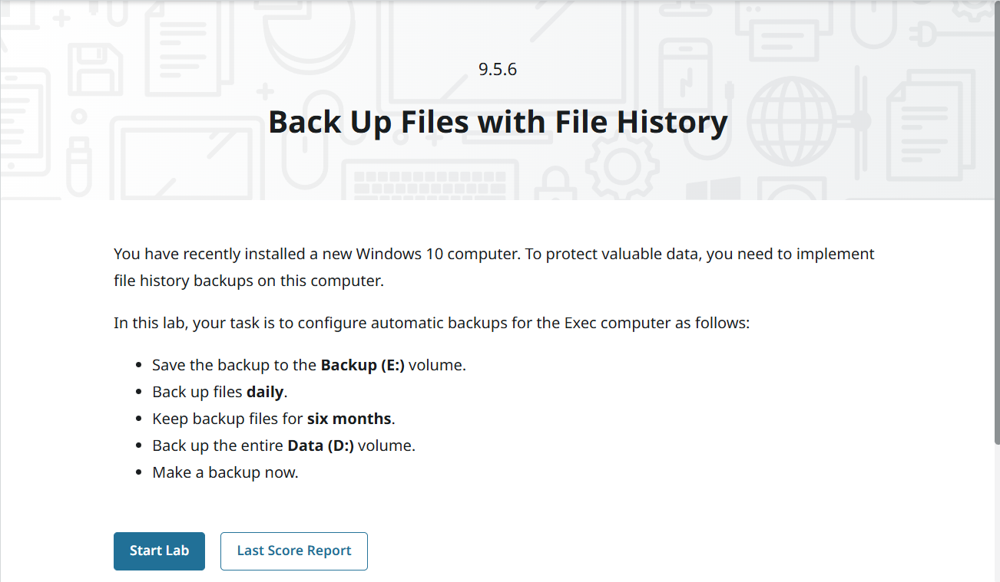

### คำอธิบาย
ใน Windows 10 มีฟีเจอร์ File History  
ใช้สำหรับสำรองข้อมูลไฟล์แบบอัตโนมัติ โดยสามารถเลือกไดรฟ์ปลายทาง และตั้งค่าระยะเวลาการสำรองข้อมูลได้

---

## Required Actions (สิ่งที่ต้องทำ)

- ตั้งค่าไดรฟ์ backup (Backup E:)
- ตั้งค่า backup แบบรายวัน (Daily)
- เก็บไฟล์ backup เป็นเวลา 6 เดือน
- ทำการ backup โฟลเดอร์ Data (D:)
- สั่ง Make a backup now

---
## ขั้นตอนการทำงาน
   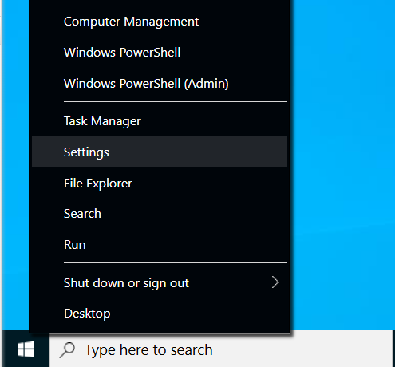
1. คลิกปุ่ม **Start** แล้วเลือก **Settings**  
---
   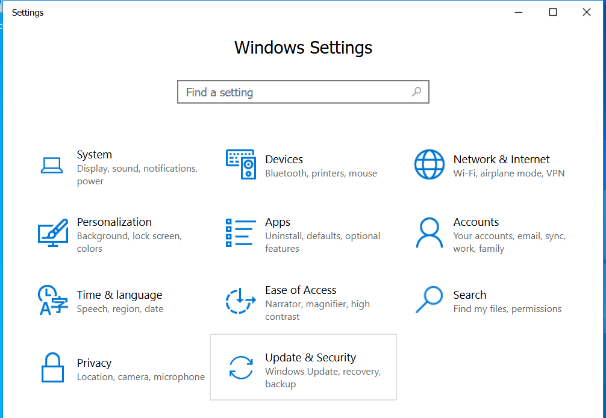
   
2. เลือกเมนู **Update & Security**  
---
   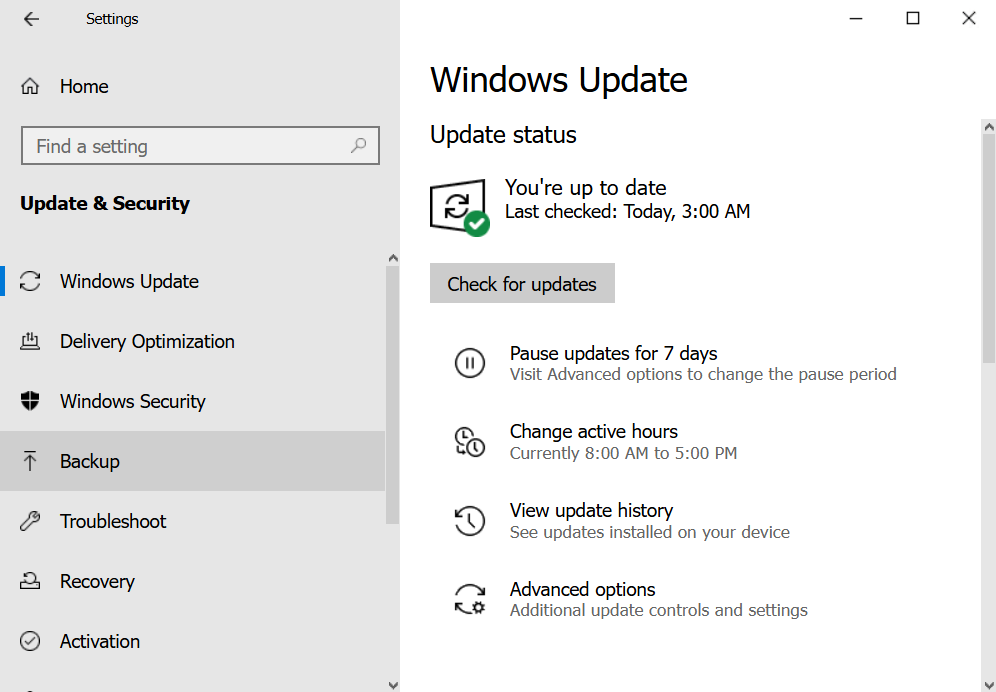
   
3. เลือกเมนู **Backup**  
---
   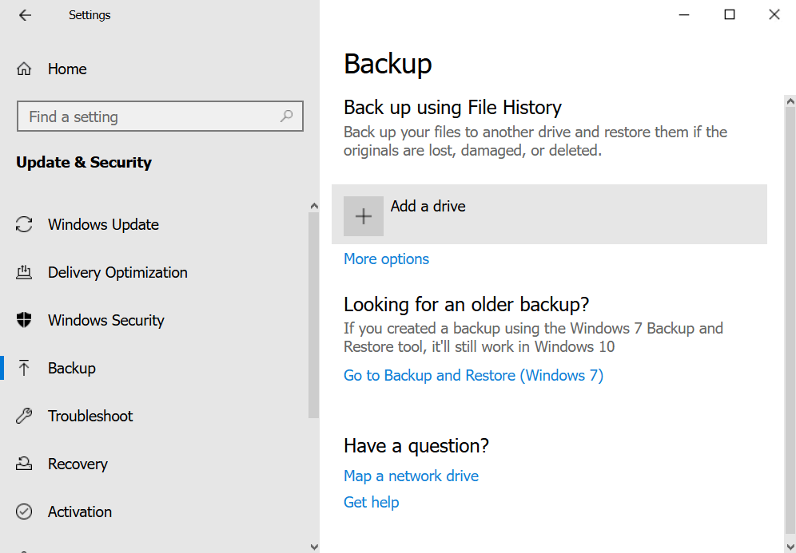
   
5. คลิก **Add a drive**  
---
   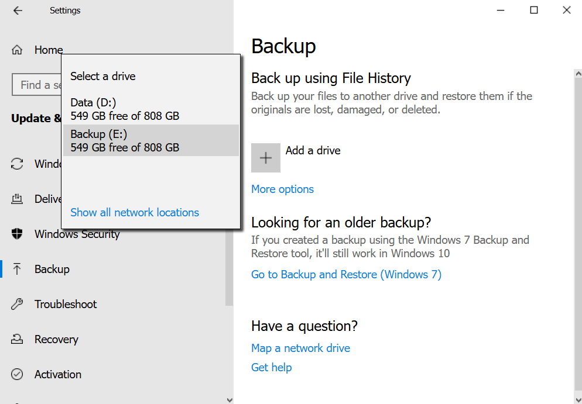
   
6. เลือกไดรฟ์ **Backup (E:)**  
---
   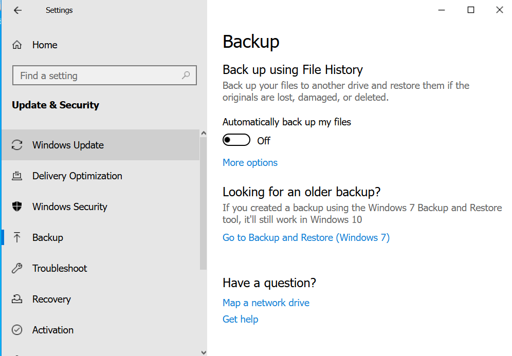  
   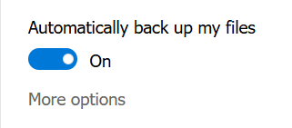
   
7. เปิดสวิตช์ **Automatically back up my files** เป็น **On**  
---
   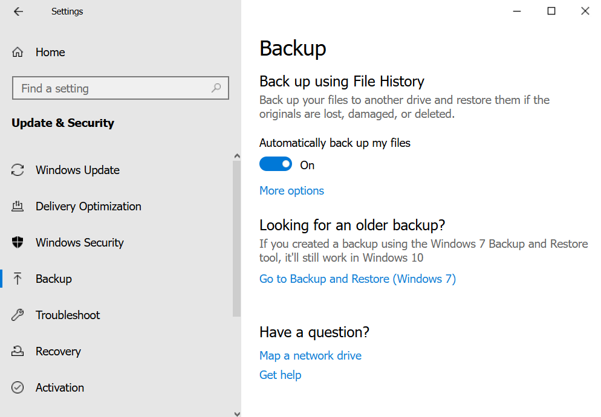
   
8. คลิก **More options**  
---
   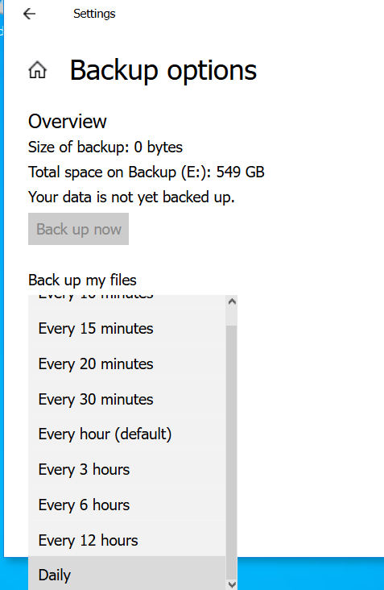
   
10. ตั้งค่า **Back up my files** จาก drop-down menu เป็น **Daily**  
---
   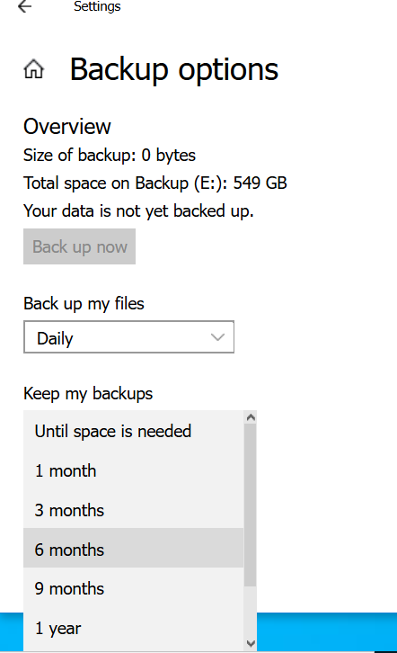
   
12. ตั้งค่า **Keep my backups** จาก drop-down menu เป็น **6 months**  
---
   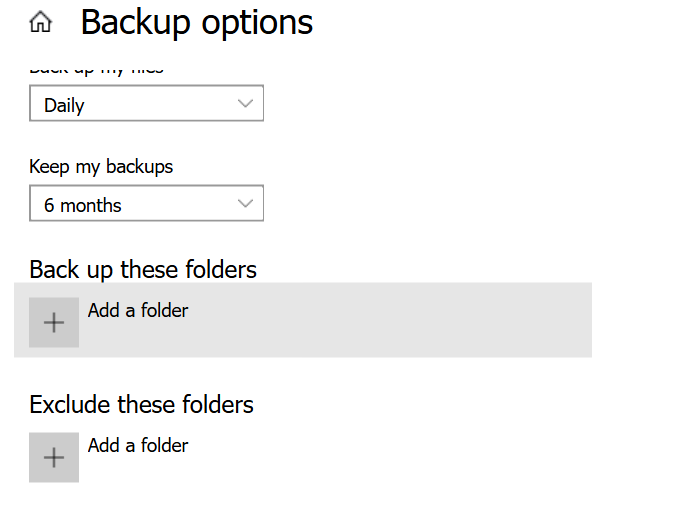
   
13. ตั้งค่า **Back up these folders** แล้วคลิก **Add a folder**  
---
   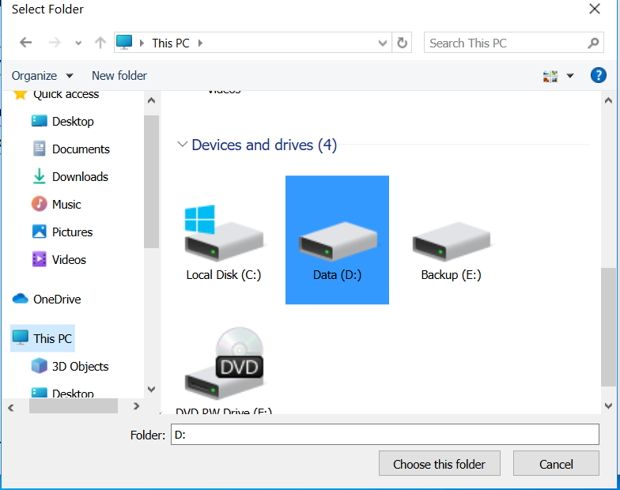  
   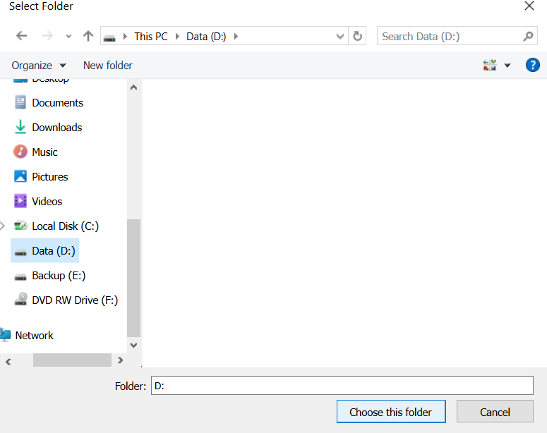
   
14. เลือกโฟลเดอร์ **Data (D:)** แล้วคลิก **Choose this folder**  
---
   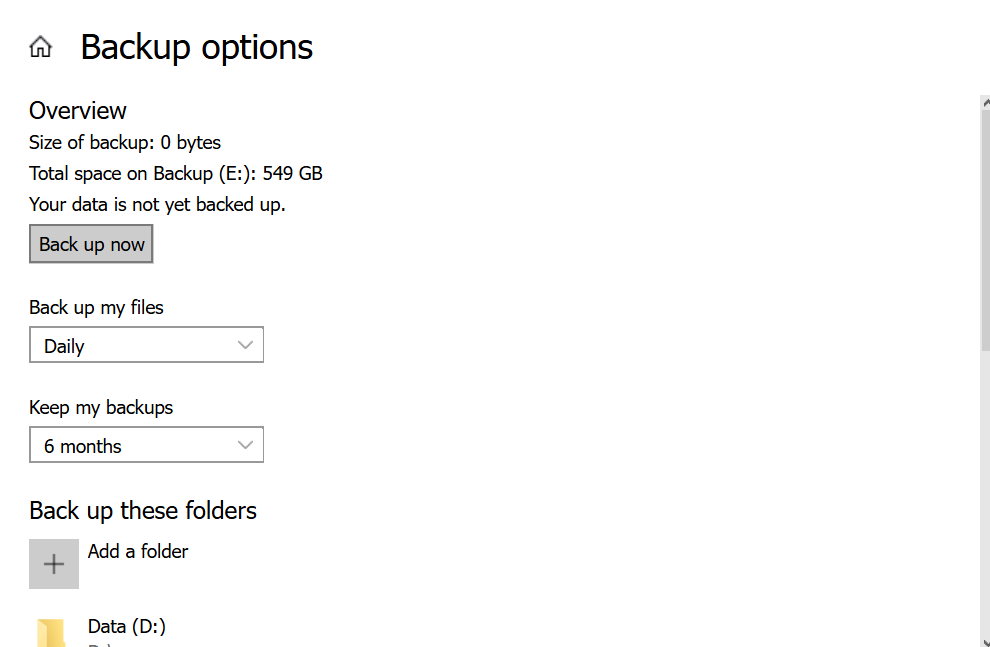
   
16. คลิก **Back up now**  
---
   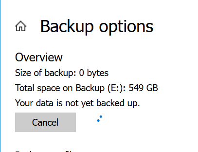
17. ตรวจสอบความสมบูรณ์ของการ backup เมื่อเสร็จสิ้น

---

## ผลลัพธ์ LAB

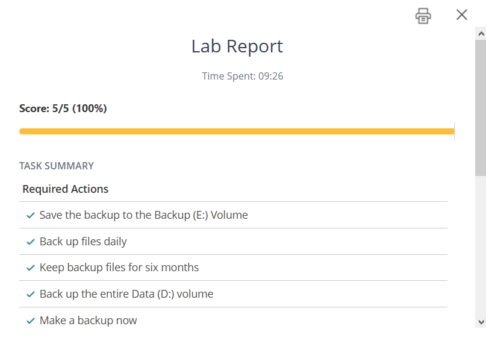

---

## คำศัพท์ที่เกี่ยวข้อง

**File History**  
: ฟีเจอร์ใน Windows สำหรับสำรองข้อมูลไฟล์อัตโนมัติ และสามารถกู้คืนไฟล์ได้

**Backup**  
: การสำรองข้อมูล เพื่อป้องกันข้อมูลสูญหาย

**Update & Security**  
: เมนูสำหรับตั้งค่าการอัปเดต และความปลอดภัยของระบบ

**Automatically back up my files**  
: ตัวเลือกสำหรับเปิดการสำรองข้อมูลอัตโนมัติ

**Daily**  
: การตั้งค่าให้สำรองข้อมูลทุกวัน

**Data (D:)**  
: ไดรฟ์ข้อมูลที่เลือกทำการสำรอง

**Volume**  
: พื้นที่จัดเก็บข้อมูลในไดรฟ์
