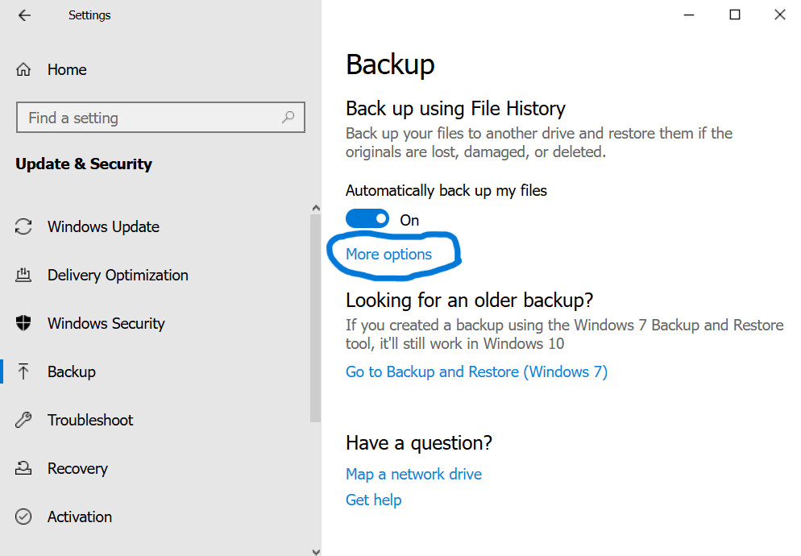

[<<ย้อนไปหน้าหลัก](README.md)
## 9.5.6 Back Up Files with File History

### คุณเพิ่งติดตั้งคอมพิวเตอร์ Windows 10 เครื่องใหม่ เพื่อปกป้องข้อมูลสำคัญ คุณจำเป็นต้องตั้งค่า File History backups บนคอมพิวเตอร์เครื่องนี้
Required Actions (สิ่งที่ต้องทำ)

📥บันทึกไฟล์สำรอง (backup) ไปยังไดรฟ์ Backup (E:)
⚙️ตั้งค่าให้ back up ไฟล์ทุกวัน (daily)
📩เก็บไฟล์ backup ไว้เป็นระยะเวลา 6 เดือน
💾ทำการ back up ทั้งไดรฟ์ Data (D:)
📌สั่ง Make a backup now
---
### ขั้นตอนในการทำ

1. คลิกขวาที่ปุ่ม Start แล้วเลือก Settings

2. เลือกเมนู Update & Security

3. จากแถบด้านซ้าย เลือก Backup

4. ที่แถบด้านขวา เลือก Add a drive

5. เลือกไดรฟ์ Backup E:
 
6. ใต้หัวข้อ Automatically back up my files เลื่อนสวิตช์เป็น On

7. เลือก More options

8. ใต้หัวข้อ Back up my files ใช้ drop-down menu เลือก Daily

9. ใต้หัวข้อ Keep my backups ใช้ drop-down menu เลือก 6 months

10. ใต้หัวข้อ Back up these folders เลือก Add a folder
 
11. ดับเบิลคลิกไดรฟ์ Data (D:) แล้วเลือก Choose this folder

12. เลือก Back up now

13. รอจนกระบวนการ backup เสร็จสมบูรณ์

---
ผลการทำ LAB

---
### คำศัพท์ที่เกี่ยวข้อง
File History:ฟีเจอร์ของ Windows สำหรับสำรองข้อมูลไฟล์แบบอัตโนมัติ และสามารถกู้ไฟล์เวอร์ชันเก่าได้
---
Backup:การสำรองข้อมูล เพื่อป้องกันข้อมูลสูญหาย
---
Update & Security:เมนูสำหรับจัดการการอัปเดตและความปลอดภัยของระบบ
---
Automatically back up my files:ตัวเลือกให้ระบบสำรองไฟล์ให้อัตโนมัติ
---
Daily:ตั้งค่าให้สำรองข้อมูลทุกวัน
---
Data (D:) volume:ไดรฟ์หรือพาร์ทิชัน D: ที่เก็บข้อมูล
---
Volume:พื้นที่จัดเก็บข้อมูลที่ถูกแบ่งในฮาร์ดดิสก์
---

