[<<Back to menu](README.md)

# การสำรองข้อมูล (Backup)
## 9.5.6 Back up Files with File History

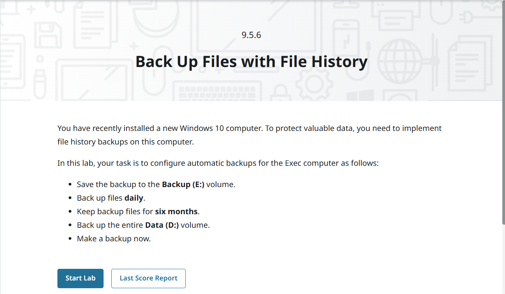

### คำอธิบาย
ใน Windows 10 มีฟีเจอร์ File History  
ใช้สำหรับสำรองข้อมูลไฟล์แบบอัตโนมัติ โดยสามารถเลือกไดรฟ์ปลายทาง และตั้งค่าระยะเวลาการสำรองข้อมูลได้

---

## Required Actions (สิ่งที่ต้องทำ)

- ตั้งค่าไดรฟ์ backup (Backup E:)
- ตั้งค่า backup แบบรายวัน (Daily)
- เก็บไฟล์ backup เป็นเวลา 6 เดือน
- ทำการ backup โฟลเดอร์ Data (D:)
- สั่ง Make a backup now

---
## ขั้นตอนการทำงาน
   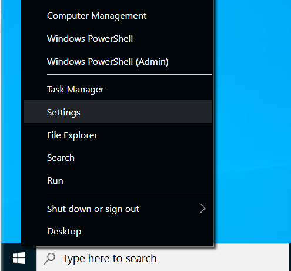
1. คลิกปุ่ม **Start** แล้วเลือก **Settings** 
   เพื่อเข้าสู่เมนูการตั้งค่าหลักของระบบปฏิบัติการ Windows ซึ่งเป็นจุดศูนย์รวมสำหรับการปรับแต่งและจัดการการทำงานของคอมพิวเตอร์ 
   Settings คือศูนย์รวมการตั้งค่าทั้งหมดของ Windows ซึ่งรวมถึงระบบความปลอดภัยและการสำรองข้อมูล การเข้าถึงผ่านช่องทางนี้ทำให้มั่นใจได้ว่าการเปลี่ยนแปลงใดๆ จะถูกบันทึกลงในระบบจริงและมีผลถาวร ไม่ใช่การตั้งค่าชั่วคราว
---
   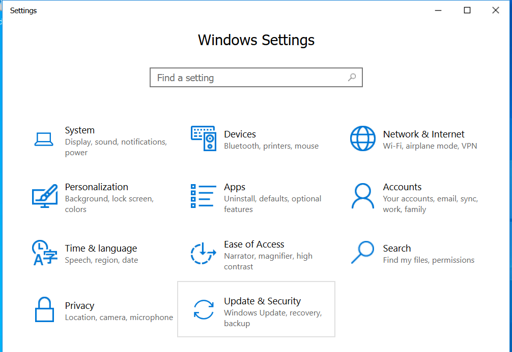
   
2. เลือกเมนู **Update & Security** 
   เมนูนี้ใช้สำหรับจัดการด้านความปลอดภัยของระบบ การอัปเดตระบบ และการป้องกันข้อมูล รวมถึงการสำรองข้อมูลเพื่อความปลอดภัยของไฟล์ 
   เมนูนี้เป็นที่รวมฟีเจอร์ด้านความปลอดภัยและความต่อเนื่องของข้อมูลทั้งหมดไว้ด้วยกัน แนวคิดเบื้องหลังคือ Microsoft มองว่า "การสำรองข้อมูล" เป็นส่วนหนึ่งของ กลยุทธ์ความปลอดภัย ไม่ใช่แค่ฟีเจอร์เสริม เพราะข้อมูลที่ไม่มีสำเนาสำรองถือเป็นความเสี่ยงด้านความปลอดภัยอย่างหนึ่ง
---
   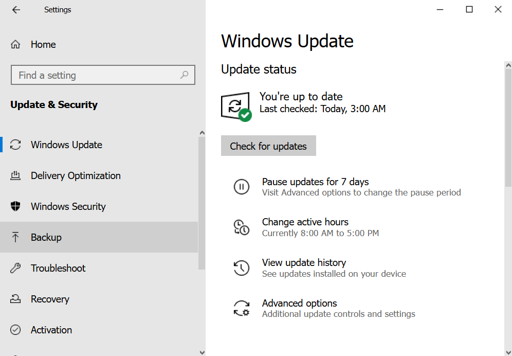
   
3. เลือกเมนู **Backup** 
   เพื่อเข้าสู่หน้าการตั้งค่าการสำรองข้อมูล ซึ่งช่วยให้ผู้ใช้สามารถกำหนดรูปแบบ วิธีการ และตำแหน่งในการจัดเก็บข้อมูลสำรองได้  
   เมนู Backup เป็นอินเทอร์เฟซหลักสำหรับจัดการ File History ซึ่งเป็นระบบสำรองข้อมูลในตัวของ Windows ที่ออกแบบมาเพื่อให้ผู้ใช้ทั่วไปสามารถตั้งค่าได้ง่ายโดยไม่ต้องมีความรู้เทคนิคลึก การเข้ามาที่นี่ก่อนคือการประกาศว่าเราจะใช้กลไก backup ระดับระบบปฏิบัติการ ซึ่งเชื่อถือได้และทำงานเบื้องหลังอัตโนมัติ
---
   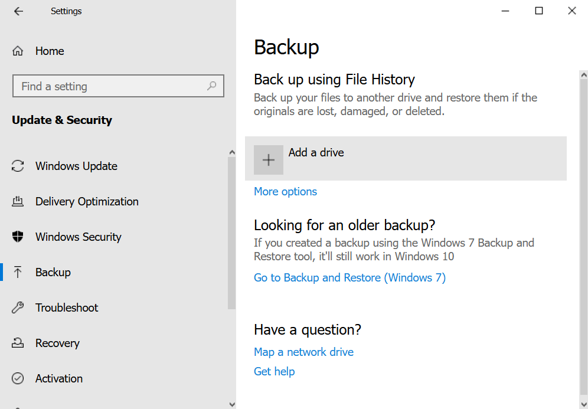
   
4. คลิก **Add a drive** 
   เพื่อเลือกอุปกรณ์จัดเก็บข้อมูลภายนอกที่ใช้สำหรับเก็บไฟล์สำรอง ป้องกันความเสียหายจากการเก็บข้อมูลไว้ในไดรฟ์เดียวกับระบบ   
   Windows จำเป็นต้องรู้ว่าจะเก็บข้อมูลสำรองไว้ที่ไหน การเลือก drive ภายนอกเป็นการปฏิบัติตามหลัก 3-2-1 Backup Rule ที่แนะนำว่าควรมีข้อมูลอย่างน้อย 2 สำเนา บน 2 สื่อที่แตกต่างกัน เพื่อป้องกันกรณีที่สื่อชิ้นใดชิ้นหนึ่งเสียหายพร้อมกัน
---
   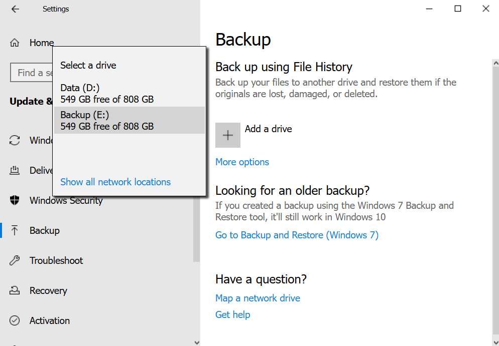
   
5. เลือกไดรฟ์ **Backup (E:)** 
   เป็นการกำหนดปลายทางสำหรับจัดเก็บข้อมูลสำรอง ซึ่งช่วยแยกข้อมูลสำคัญออกจากไดรฟ์ระบบ  
   การระบุปลายทางที่ชัดเจนเป็นการกำหนด Backup Destination ซึ่งเป็นพารามิเตอร์สำคัญที่สุดของระบบ backup เพราะหากไม่มีปลายทาง ระบบไม่สามารถทำงานได้เลย การเลือก Drive E: ที่ตั้งชื่อว่า "Backup" ช่วยป้องกันความสับสนในอนาคต และเป็นการแยกหน้าที่ของแต่ละ drive ให้ชัดเจน
---
   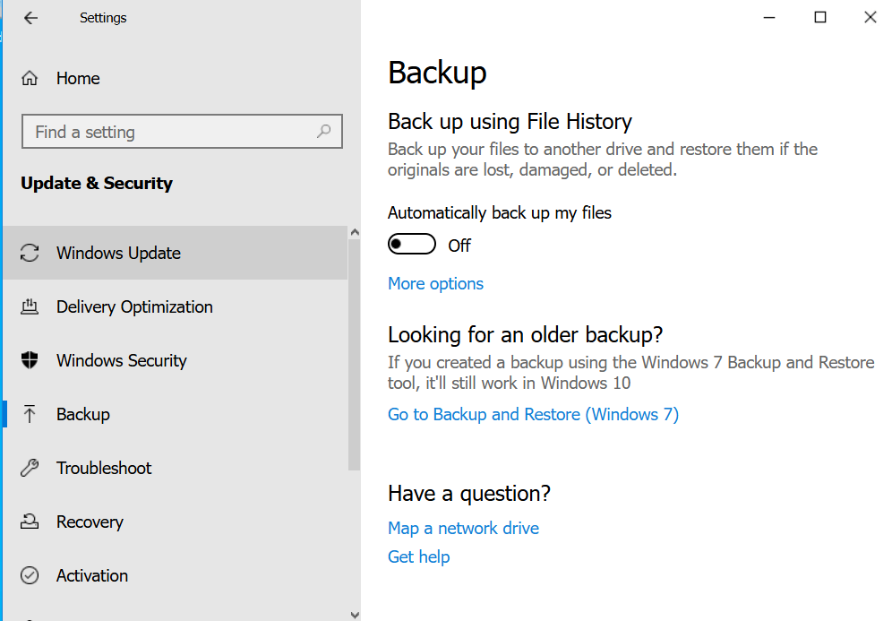  
   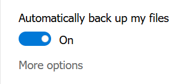
   
6. เปิดสวิตช์ **Automatically back up my files** เป็น **On** 
   เพื่อให้ระบบทำการสำรองข้อมูลโดยอัตโนมัติ ลดความเสี่ยงจากการลืมสำรองข้อมูลด้วยตนเอง   
   ความล้มเหลวของการสำรองข้อมูลส่วนใหญ่ในองค์กรและการใช้งานส่วนบุคคลเกิดจาก Human Error คือลืมสำรอง หรือเลื่อนออกไปเรื่อยๆ การเปิด Automatic Backup ตัดปัญหานี้ออกไปทั้งหมด ระบบจะทำงานตามกำหนดเวลาโดยไม่ต้องอาศัยการจำหรือวินัยของผู้ใช้
---
   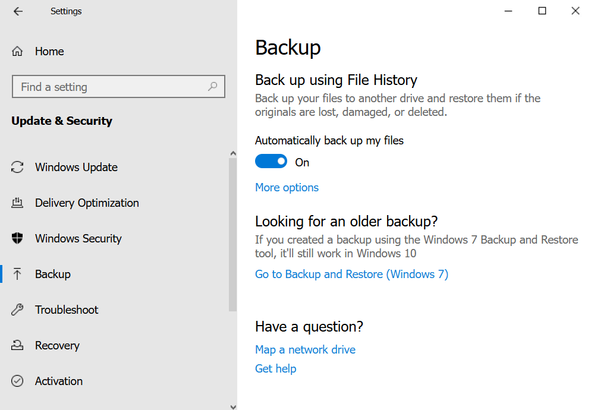
   
7. คลิก **More options** 
   เพื่อกำหนดรายละเอียดเพิ่มเติมเกี่ยวกับความถี่ในการสำรองข้อมูล ระยะเวลาในการจัดเก็บไฟล์ และโฟลเดอร์ที่ต้องการสำรอง  
   การตั้งค่าเริ่มต้น (Default) ของ Windows อาจไม่เหมาะกับการใช้งานของทุกคน เช่น ความถี่ในการ backup หรือระยะเวลาเก็บข้อมูลอาจน้อยหรือมากเกินไป การเข้า More options ทำให้เราสามารถ ปรับแต่งตามความต้องการจริง แทนที่จะยอมรับค่า Default โดยไม่ตรวจสอบ
---
   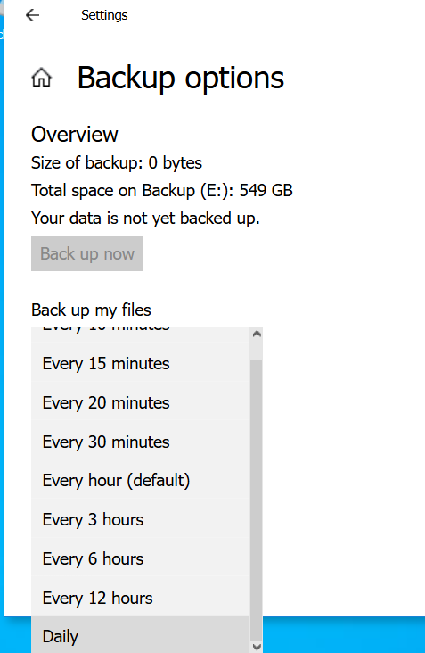
   
8. ตั้งค่า **Back up my files** จาก drop-down menu เป็น **Daily** 
   เพื่อให้ระบบสำรองข้อมูลทุกวัน ซึ่งเหมาะสมกับข้อมูลที่มีการเปลี่ยนแปลงเป็นประจำ  
   ความถี่ในการ backup ควรสอดคล้องกับ RPO (Recovery Point Objective) คือนิยามว่ายอมรับได้ว่าข้อมูลหายไปได้มากที่สุดเท่าไร หากตั้งค่าเป็น Weekly แต่ข้อมูลมีการเปลี่ยนแปลงทุกวัน เมื่อเกิดปัญหาขึ้นจะสูญเสียข้อมูลได้สูงสุดถึง 7 วัน แต่ Daily ทำให้การสูญหายข้อมูลสูงสุดไม่เกิน 1 วัน
---
   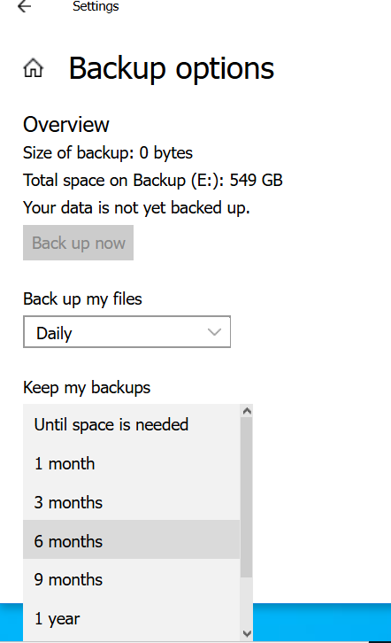
   
9. ตั้งค่า **Keep my backups** จาก drop-down menu เป็น **6 months** 
    เพื่อกำหนดระยะเวลาในการเก็บข้อมูลสำรองย้อนหลัง ช่วยให้สามารถกู้คืนข้อมูลในช่วงเวลาที่ต้องการได้   
    การกำหนดระยะเวลาเก็บข้อมูล backup มีความสำคัญด้วยเหตุผล 2 ประการคือ ด้านการกู้คืน — บางครั้งความผิดพลาดถูกค้นพบช้า เช่น ไฟล์ถูกลบหรือแก้ไขผิดพลาดไปหลายสัปดาห์ก่อน การมี backup ย้อนหลัง 6 เดือนทำให้สามารถกู้คืนจากจุดที่ถูกต้องได้ และ ด้านพื้นที่จัดเก็บ — การเก็บตลอดไปจะทำให้ drive เต็มในที่สุด การกำหนด retention period ช่วยบริหารพื้นที่อย่างมีประสิทธิภาพ
---
   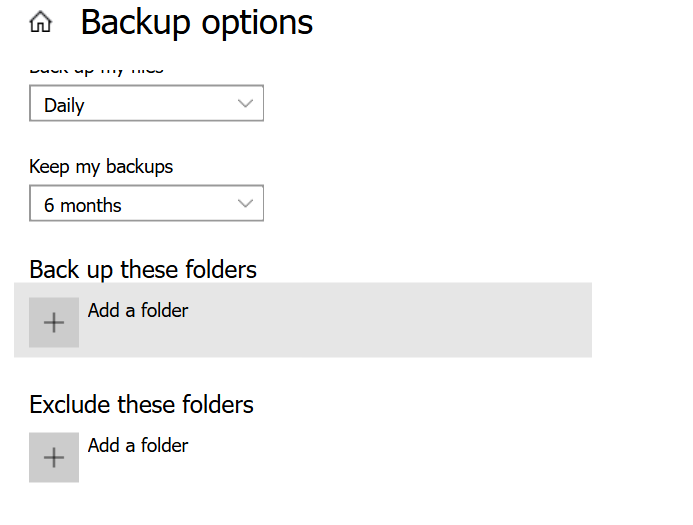
   
10. ตั้งค่า **Back up these folders** แล้วคลิก **Add a folder** 
    เพื่อเลือกเฉพาะโฟลเดอร์ที่มีความสำคัญ ลดพื้นที่จัดเก็บและเพิ่มประสิทธิภาพในการสำรองข้อมูล  
    Windows มักจะ backup เฉพาะโฟลเดอร์มาตรฐาน เช่น Documents, Pictures, Desktop แต่ไฟล์งานจริงอาจอยู่ใน drive หรือโฟลเดอร์อื่น หากไม่ระบุเพิ่ม ไฟล์เหล่านั้นจะไม่ถูกสำรองข้อมูลเลย ทำให้เกิด False Sense of Security คือคิดว่า backup ครบแล้วแต่จริงๆ ยังขาดไฟล์สำคัญ
---
   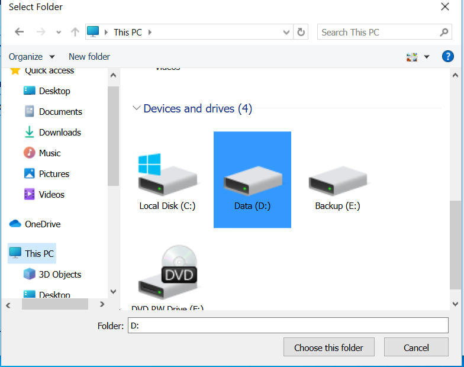  
   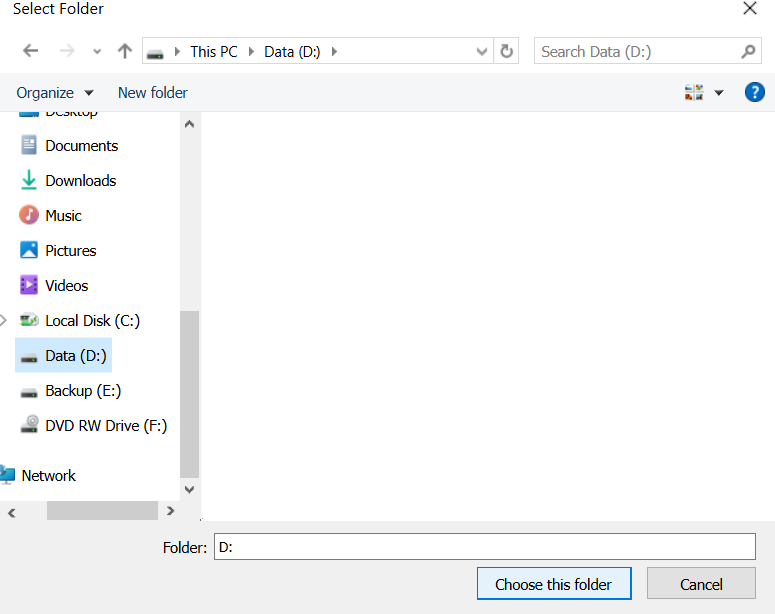
   
11. เลือกโฟลเดอร์ **Data (D:)** แล้วคลิก **Choose this folder** 
    เพื่อสำรองข้อมูลสำคัญที่จัดเก็บอยู่ในไดรฟ์ D: ซึ่งมักเป็นที่เก็บไฟล์งานหรือเอกสารสำคัญ   
    Drive D: มักถูกใช้เป็นที่เก็บไฟล์งานและข้อมูลสำคัญ แยกจาก Drive C: ที่เป็น System Drive เพื่อให้ง่ายต่อการจัดการ แต่ระบบ backup เริ่มต้นจะไม่ครอบคลุม Drive D: โดยอัตโนมัติ การเพิ่มโฟลเดอร์นี้จึงเป็นการปิด ช่องว่างของ backup (Backup Gap) ที่อาจทำให้ไฟล์งานสำคัญไม่ได้รับการป้องกัน
---
   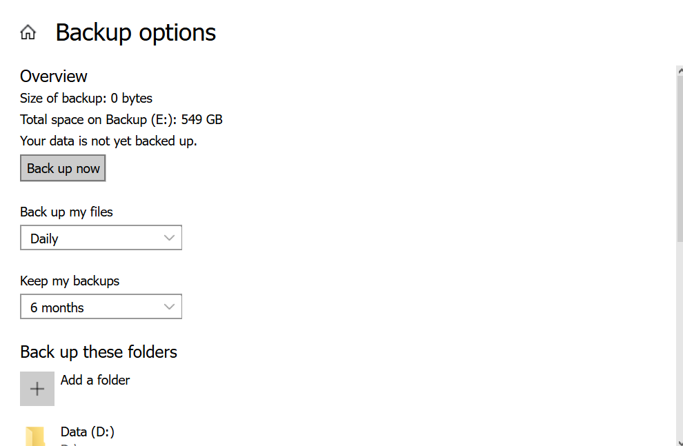
   
12. คลิก **Back up now** 
    เพื่อเริ่มต้นการสำรองข้อมูลทันที และตรวจสอบว่าระบบสามารถทำงานได้ถูกต้องตามที่ตั้งค่าไว้  
    การตั้งค่าแบบ Automatic หมายความว่า backup แรกจะเกิดขึ้นตามรอบเวลาที่กำหนด ซึ่งอาจเป็นพรุ่งนี้หรือวันถัดไป การกด Back up now เป็นการ ทดสอบระบบทันที ว่าการตั้งค่าทั้งหมดทำงานได้จริงหรือไม่ ก่อนที่จะพึ่งพาระบบในการทำงานอัตโนมัติ นอกจากนี้ยังเป็นการสร้าง snapshot แรกของข้อมูลปัจจุบันเป็น baseline
---
   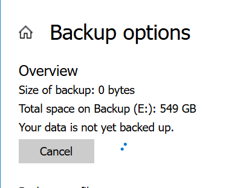
   
13. ตรวจสอบความสมบูรณ์ของการ backup เมื่อเสร็จสิ้น 
    เพื่อยืนยันว่าข้อมูลถูกสำรองเรียบร้อย ไม่มีข้อผิดพลาด และสามารถนำไปใช้กู้คืนได้ในกรณีฉุกเฉิน 
    ขั้นตอนสุดท้ายนี้คือการ Verification ซึ่งเป็นส่วนที่คนมักข้ามไปมากที่สุด แต่มีความสำคัญอย่างยิ่ง เพราะการที่ระบบ "ทำงาน" ไม่ได้รับประกันว่า backup "สมบูรณ์" เสมอไป อาจเกิดข้อผิดพลาดระหว่างกระบวนการโดยที่ผู้ใช้ไม่รู้ตัว การตรวจสอบให้แน่ใจว่าวันที่และเวลา backup ล่าสุดถูกต้อง และไม่มี error message ปรากฏ คือขั้นตอนที่ยืนยันว่าระบบทั้งหมดพร้อมใช้งานในกรณีฉุกเฉินจริงๆ
---

## ผลลัพธ์ LAB

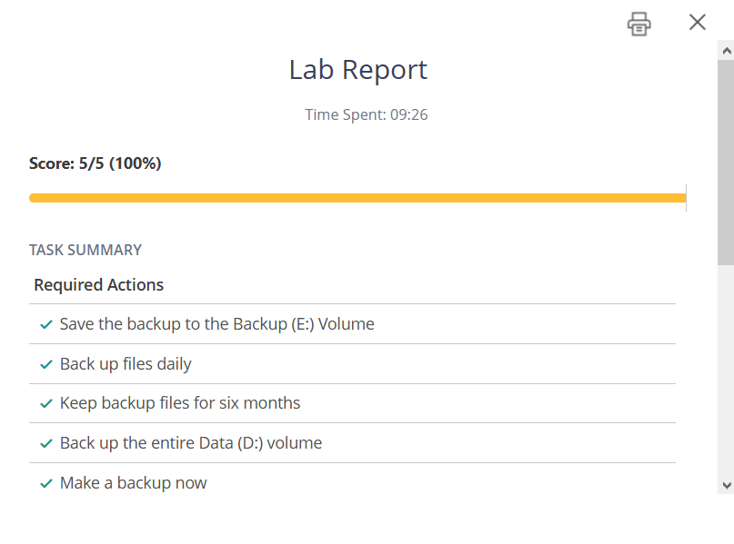

---

## คำศัพท์ที่เกี่ยวข้อง

**File History**  
: ฟีเจอร์ใน Windows สำหรับสำรองข้อมูลไฟล์อัตโนมัติ และสามารถกู้คืนไฟล์ได้

**Backup**  
: การสำรองข้อมูล เพื่อป้องกันข้อมูลสูญหาย

**Update & Security**  
: เมนูสำหรับตั้งค่าการอัปเดต และความปลอดภัยของระบบ

**Automatically back up my files**  
: ตัวเลือกสำหรับเปิดการสำรองข้อมูลอัตโนมัติ

**Daily**  
: การตั้งค่าให้สำรองข้อมูลทุกวัน

**Data (D:)**  
: ไดรฟ์ข้อมูลที่เลือกทำการสำรอง

**Volume**  
: พื้นที่จัดเก็บข้อมูลในไดรฟ์

---
[<<Back to menu](README.md)
