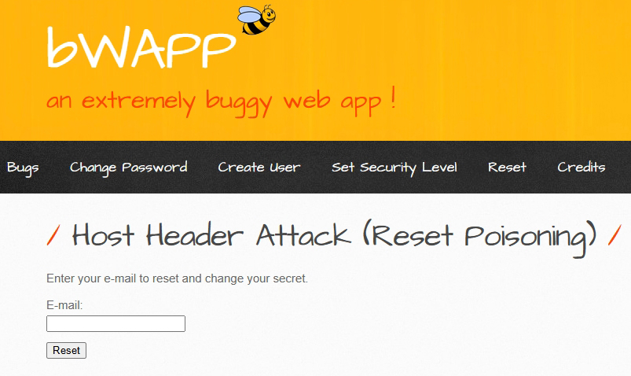
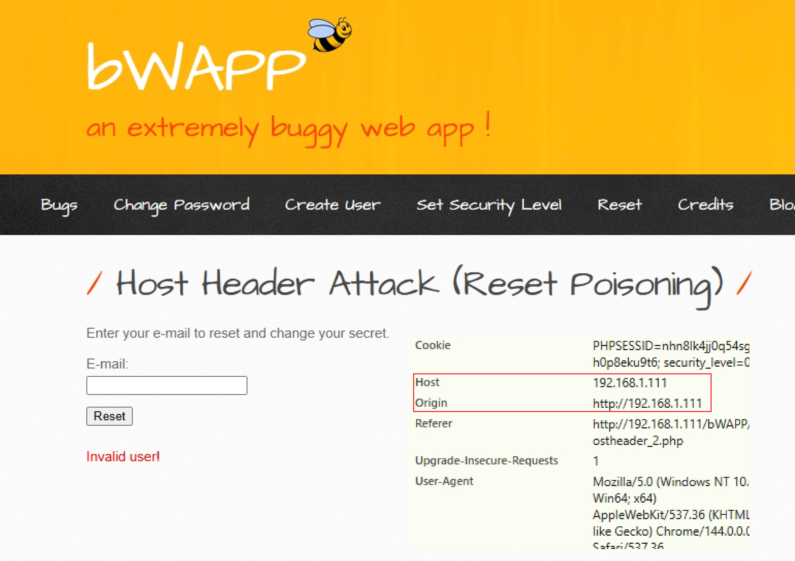
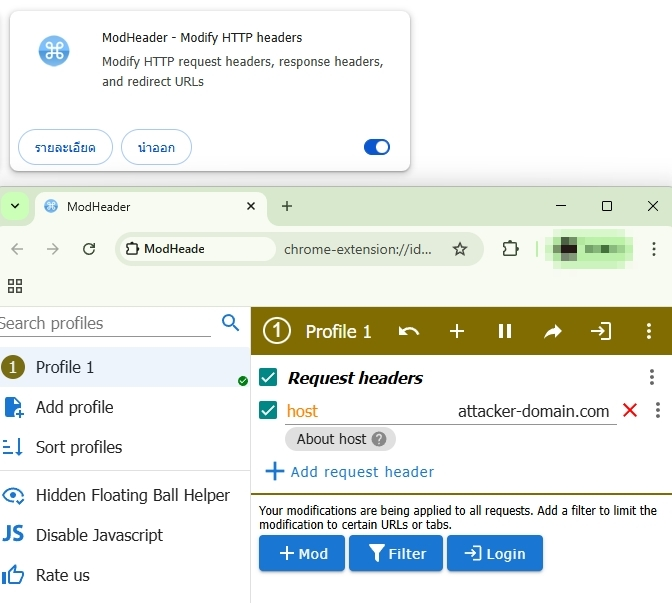
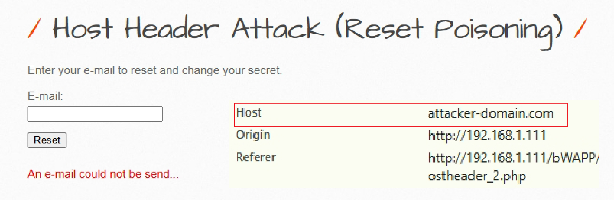
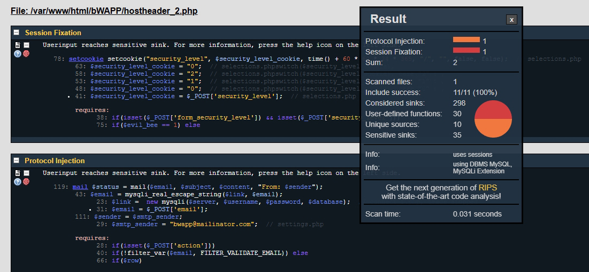
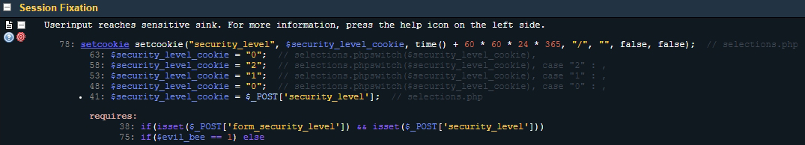
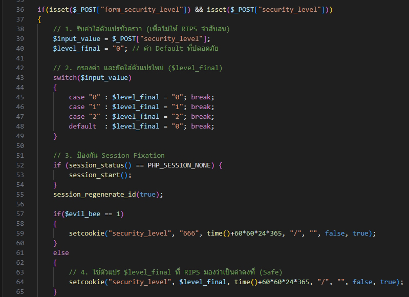
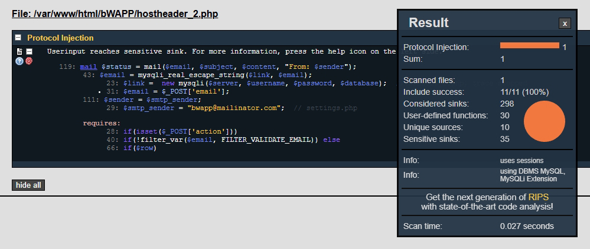
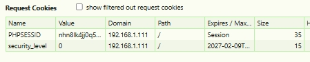

# ช่องโหว่ Host Header Attack (Password Reset Poisoning)
---------------------------------------------------------------------

## 1. ภาพรวมของระบบ

หน้าเว็บนี้เป็นส่วนหนึ่งของฟีเจอร์ **"Reset Password"** โดยมีหน้าที่หลักในการรับอีเมลจากผู้ใช้เพื่อดำเนินการเปลี่ยนรหัสผ่าน (Secret) หลังจากผู้ใช้กดปุ่ม **"Reset"** แล้ว ระบบจะจัดส่งอีเมลที่ประกอบด้วยลิงก์สำหรับตั้งรหัสผ่านใหม่ไปยังอีเมลปลายทางที่ระบุ



---

## 2. การวิเคราะห์และช่องโหว่ที่พบ

ระบบนี้มีจุดอ่อนที่เรียกว่า **Host Header Attack (Reset Poisoning)** สาเหตุมาจากการที่แอปพลิเคชันนำค่าของ HTTP Host Header ซึ่งส่งมาจากเบราว์เซอร์ของผู้ใช้ไปใช้สร้าง URL ในอีเมลโดยตรง โดยไม่มีการตรวจสอบ

**กระบวนการโจมตีมี 3 ขั้นตอน ดังนี้**

### ขั้นตอนที่ 1 — ดักจับคำร้องขอ (Intercept Request)

ผู้โจมตีกรอกอีเมลของเหยื่อ (เช่น `alice@alice.com`) แล้วกดปุ่ม Reset จากนั้นดักจับ HTTP Request โดย Host Header ต้องแสดงค่า IP ของเซิร์ฟเวอร์จริง เช่น:

```
Host: 192.168.1.111
```



> **เครื่องมือที่ใช้จำลองการโจมตี**



---

### ขั้นตอนที่ 2 — ปลอมค่าโดเมน (Host Header Manipulation)

ผู้โจมตีแก้ไขค่า `Host:` ใน Request จาก IP จริงของแล็บ (เช่น `192.168.1.111`) ให้เป็นโดเมนของตนเอง โดยใช้ Mod Headers เป็นตัวช่วยจำลอง:



```http
POST /bWAPP/hostheader_2.php HTTP/1.1
Host: attacker-domain.com  <-- (ค่าที่ถูกดัดแปลง)
Content-Type: application/x-www-form-urlencoded
...
email=bee@bee.pwn&action=reset
```

---

### ขั้นตอนที่ 3 — ผลจากการโจมตี (Attack Result)

เมื่อส่งต่อ (Forward) Request ที่ดัดแปลงแล้วไปยัง Server เหยื่อจะได้รับอีเมลที่มีลิงก์รีเซ็ตรหัสผ่านที่ชี้ไปยังเซิร์ฟเวอร์ของผู้โจมตีแทน เช่น:

```
http://attacker-domain.com/bWAPP/secret_change.php?...
```

ส่งผลให้ผู้โจมตีสามารถขโมย Token รีเซ็ตรหัสผ่านของเหยื่อได้ทันที

---

## 3. การสแกนด้วยเครื่องมือ RIPS

นำไฟล์ `/var/www/html/bWAPP/hostheader_2.php` เข้าสู่การวิเคราะห์ด้วย **RIPS Scanner** ผลลัพธ์ยืนยันการมีอยู่ของช่องโหว่ ได้แก่:

| ประเภทช่องโหว่ | จำนวนที่พบ | ไฟล์ที่เกี่ยวข้อง |
|---|---|---|
| Protocol Injection | 1 จุด | hostheader_2.php |
| Session Fixation | 1 จุด | selections.php |



---

## 4. รายละเอียดช่องโหว่เพิ่มเติม — Session Fixation

นอกเหนือจากปัญหาการส่งอีเมล RIPS ยังตรวจพบช่องโหว่ใน **Session Management** ที่บรรทัดที่ 78 ของไฟล์ `selections.php`

**จุดอ่อน (Vulnerable Sink):** การเรียกใช้ฟังก์ชัน `setcookie()`

**ต้นเหตุ:** ระบบนำค่าจาก `$_POST['security_level']` มาใช้สร้าง Cookie โดยตรง หากระบบยอมรับค่า Session ID ที่มาจากผู้ใช้ (Tainted Source) ก็จะเกิดช่องโหว่นี้ขึ้น

> **ผลกระทบ:** ผู้โจมตีสามารถ "บังคับ" (Fixate) ให้เหยื่อใช้ Session ID ที่ตนรู้ค่าอยู่ล่วงหน้า พอเหยื่อเข้าสู่ระบบสำเร็จ ผู้โจมตีก็ใช้ Session ID เดิมนั้นแอบอ้างตัวตนเพื่อเข้าถึงบัญชีของเหยื่อได้



---

## 5. แนวทางแก้ไขและเสริมความมั่นคงปลอดภัย (Patch Strategy)

การแก้ไขต้องดำเนินการในระดับสถาปัตยกรรม เพื่อปิดช่องโหว่ได้หลายจุดพร้อมกัน:

1. **Output Encoding**
   ใช้ `htmlspecialchars()` เพื่อแปลงอักขระพิเศษ เช่น `< > " ' &` ให้เป็น HTML entities (เช่น `&lt;` หรือ `&quot;`) วิธีนี้ช่วยป้องกันทั้ง XSS และ Protocol Injection ในระบบอีเมล

2. **Defense in Depth — Hardcoded Domain**
   แนวทางที่แข็งแกร่งที่สุดสำหรับหน้า Reset Password คือการกำหนดค่าโดเมนแบบตายตัวในโค้ด (Static/Hardcoded) แทนการอ่านจาก Header ทุกระดับความปลอดภัย เพื่อตัดโอกาสการโจมตีจากอินพุตภายนอกออกอย่างสิ้นเชิง

---

## 6. การแก้ไขโค้ดจริง

ดำเนินการแก้ไขในไฟล์ `selections.php` ที่ path `/var/www/html/bWAPP/` ดังนี้:

- **เปลี่ยนวิธีรับค่า:** นำค่าจาก `$_POST['security_level']` ไปพักใน `$input_value` ก่อน แล้วใช้ `switch` เพื่อกำหนดค่าให้กับตัวแปรใหม่ `$level_final` แทน วิธีนี้ทำให้ RIPS มั่นใจว่าค่าที่นำไปใช้เป็นค่าที่ระบบกำหนดเอง (`0`, `1`, `2`) ไม่ใช่ข้อมูลที่ไม่น่าเชื่อถือจากภายนอก
- **เพิ่ม:** คำสั่ง `session_regenerate_id(true);` เพื่อออกรหัสเซสชันใหม่ทุกครั้ง
- **ปรับ:** พารามิเตอร์สุดท้ายใน `setcookie(...)` จาก `false` เป็น `true` เพื่อเปิดใช้ HttpOnly



---

## 7. การทดสอบหลังแพตช์ (Regression & Security Test)

สแกนซ้ำด้วย RIPS พบว่าจำนวนช่องโหว่ลดลงเหลือเพียง 1 รายการ จากนั้นทดสอบการส่งอีเมลอีกครั้ง



ทดสอบการโจมตีซ้ำด้วยวิธี Host Header Poisoning:

- กรอก `alice@alice.com` และกดปุ่ม Reset
- แม้ว่า Request จะยังมี `Host: attacker-domain.com` อยู่ แต่ระบบที่แก้ไขแล้วจะไม่นำค่านั้นไปใช้สร้างลิงก์ในอีเมลอีกต่อไป


ตรวจสอบที่แท็บ **Cookies** พบว่า:

- คุกกี้ `security_level` บันทึกเฉพาะค่าที่ระบบอนุญาต (`0`, `1`, `2`)
- มีการสร้าง Session ID ใหม่ด้วย `session_regenerate_id(true)` ทำให้ผู้โจมตีไม่สามารถใช้ Session เดิมสวมรอยได้



---

## สรุป

> **การปรับปรุงโค้ดครั้งนี้สามารถปิดช่องโหว่ได้อย่างครบถ้วน โดยระบบยังคงรองรับการรีเซ็ตรหัสผ่านและการเปลี่ยนระดับความปลอดภัยได้ตาม Business Function เดิมทุกประการ**
